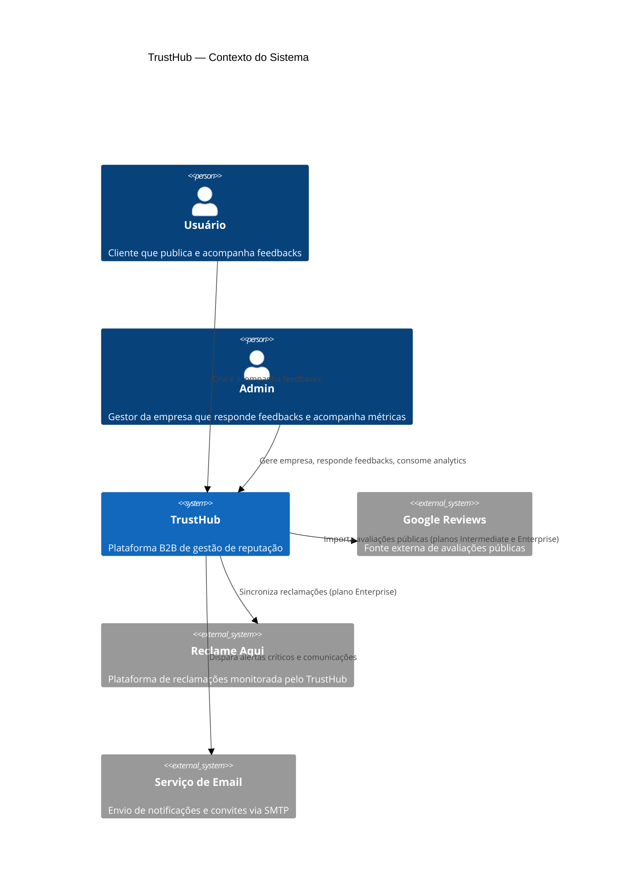
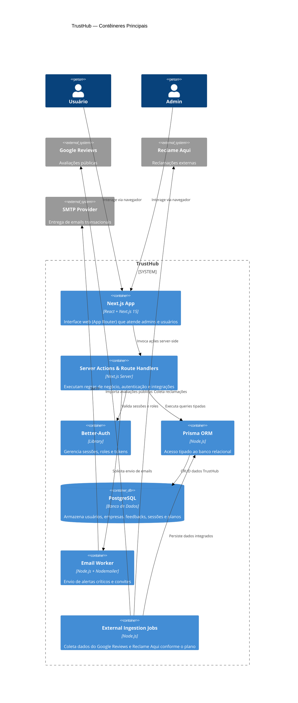
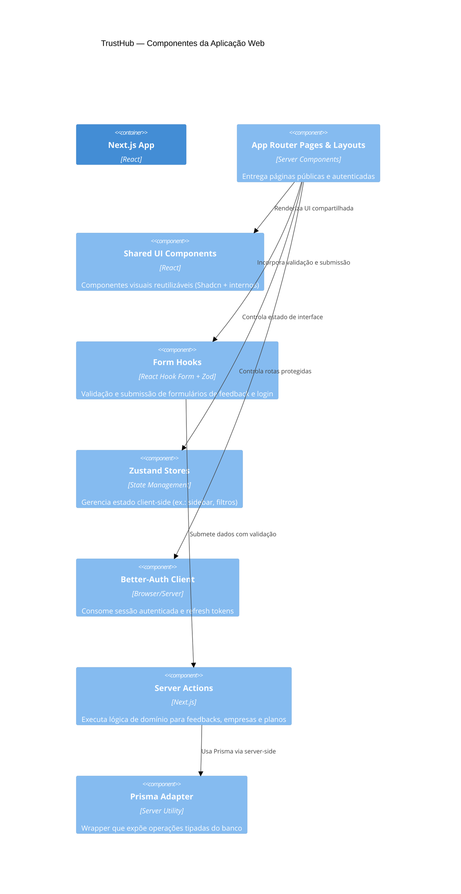
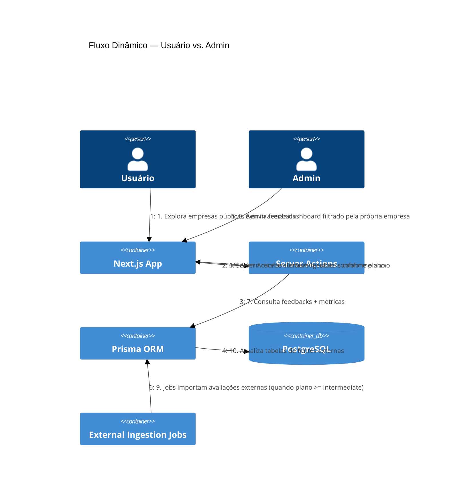

# TrustHub C4 Architecture & User Flow

Este documento apresenta a visão em múltiplos níveis do TrustHub utilizando o modelo C4, destacando como os diferentes perfis de usuário percorrem a plataforma e quais partes do sistema são acionadas em cada etapa.

## Nível 1 — Diagrama de Contexto

O objetivo é mostrar o TrustHub como um sistema único, seus atores externos e integrações principais.

## Nível 2 — Diagrama de Containers

Representa os principais contêineres (aplicações, bancos e serviços) e como eles colaboram para cumprir o fluxo de ponta a ponta.

## Nível 3 — Componentes do Next.js App

Foco na estrutura interna do contêiner `Next.js App`, destacando componentes e camadas que participam das jornadas principais.

> Nota: o `prismaClient` e demais serviços server-side residem no contêiner de Server Actions/Route Handlers mostrado no nível 2.

## Nível 4 — Fluxo Dinâmico do Usuário

O diagrama abaixo resume o fluxo completo desde o ponto de vista de cada persona, destacando condicionais relacionadas aos planos de assinatura.

## Narrativa do Fluxo do Usuário

1. **Descoberta e Login**  
   O usuário cria conta ou inicia sessão via email e senha. O fluxo de autenticação passa pelo Better-Auth, que gera tokens e vincula a sessão ao contexto correto (empresa para admins, perfil individual para usuários).  
2. **Exploração e Feedback (Usuário)**  
   Pelo catálogo público, o usuário escolhe uma empresa e envia um feedback. O formulário utiliza React Hook Form + Zod, e a submissão invoca uma Server Action que persiste o feedback no PostgreSQL via Prisma. O usuário passa a visualizar o histórico das interações na sua área pessoal.  
3. **Monitoramento e Resposta (Admin)**  
   O administrador acessa o dashboard centralizado da sua empresa. As Server Actions filtram feedbacks e métricas pelo `companyId` associado à sessão. O admin responde, atribui responsáveis e acompanha indicadores-chave.  
4. **Integração Multicanal por Plano**  
   Jobs agendados coletam avaliações externas. Clientes **Intermediate** recebem dados do Google Reviews; clientes **Enterprise** também recebem Reclame Aqui. Essas entradas alimentam os módulos de feedbacks e analytics.  
5. **Alertas e Insights**  
   Quando feedbacks críticos chegam ou padrões são detectados, notificações podem ser disparadas via Nodemailer para os admins e colaboradores, reforçando a gestão proativa da reputação.

Esses diagramas fornecem uma visão unificada da plataforma TrustHub, alinhando arquitetura técnica com as jornadas de negócio descritas no README e no documento de arquitetura.
